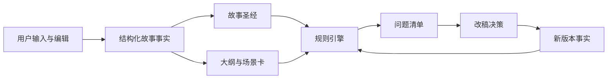
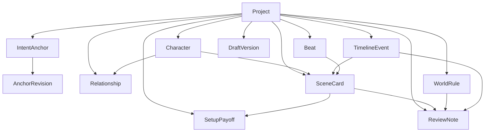

# 故事圣经与规则引擎规格

## 1. 设计目标

故事圣经和规则引擎是这类系统的底座。

如果底座不稳，后面无论是写大纲、写场景还是改稿，都会出现两个问题：

1. 系统前面说过的话后面记不住。
2. 系统能生成很多内容，但分不清哪些事实已经被推翻、哪些冲突必须修。

因此，第一版应该把“故事事实层”和“检查层”单独设计。

## 2. 总体结构



最重要的原则只有一句：

先保存事实，再生成文本；先识别问题，再建议改写。

## 3. 故事圣经对象模型

### IntentAnchor

作用：

- 保存“这部作品到底想成为什么”的最高约束

这是你提供的“原点系统”里最值得保留的一层。

最低必填字段：

- `id`
- `core_idea`
- `theme`
- `protagonist`
- `arc`
- `motif`
- `genre`
- `status`

说明：

- 这不是普通备注，而是所有生成、评审、改稿的默认参照层
- 每次修改锚点，都应该留下版本记录

### AnchorRevision

作用：

- 记录意图锚点的永久性变化

最低必填字段：

- `id`
- `intent_anchor_id`
- `changed_fields`
- `reason`
- `created_at`

### Project

作用：

- 一个作品项目的根对象

最低必填字段：

- `id`
- `title`
- `format`
- `language`
- `genre`
- `logline`
- `theme_question`
- `status`

### Character

作用：

- 保存主角、对手、配角和功能角色的长期稳定信息

最低必填字段：

- `id`
- `name`
- `story_role`
- `external_want`
- `internal_need`
- `psychological_flaw`
- `moral_flaw`
- `public_mask`
- `core_fear`
- `arc_start`
- `arc_end`

可后补字段：

- `wound`
- `contradiction`
- `voice_rules`
- `taboos`
- `secret`

### Relationship

作用：

- 保存角色之间真正产生戏剧的关系张力

最低必填字段：

- `id`
- `source_character_id`
- `target_character_id`
- `relationship_type`
- `tension`
- `power_balance`
- `shared_history`
- `hidden_information`

### WorldRule

作用：

- 保存世界观、类型前提和不能随便改动的规则

最低必填字段：

- `id`
- `rule_statement`
- `rule_level`
- `scope`
- `exceptions`
- `evidence`

说明：

- `rule_level` 建议分成 `hard`、`soft`
- `hard` 规则用于强提醒
- `soft` 规则用于创作建议

### TimelineEvent

作用：

- 保存故事里的时间顺序和因果顺序

最低必填字段：

- `id`
- `story_day`
- `sequence_index`
- `summary`
- `participants`
- `location`
- `trigger`
- `consequence`

### Beat

作用：

- 保存整体结构节点

最低必填字段：

- `id`
- `framework`
- `slot`
- `purpose`
- `linked_scene_ids`

说明：

- `framework` 可以是 `three_act`、`save_the_cat`、`story_circle`、`truby`

### SceneCard

作用：

- 把每场戏变成可检查、可排序、可比较的对象

最低必填字段：

- `id`
- `order_index`
- `title`
- `pov_character_id`
- `location`
- `time_of_day`
- `goal`
- `obstacle`
- `tactic`
- `turn`
- `value_shift`
- `new_information`
- `input_state`
- `output_state`

可后补字段：

- `dialogue_notes`
- `production_tags`
- `linked_setup_ids`

### SetupPayoff

作用：

- 追踪伏笔和回收，不让它们漂在空中

最低必填字段：

- `id`
- `setup_summary`
- `setup_scene_id`
- `expected_payoff_window`
- `status`

可后补字段：

- `payoff_scene_id`
- `payoff_summary`

### DraftVersion

作用：

- 记录不同轮次的大纲、场景或剧本文本

最低必填字段：

- `id`
- `project_id`
- `version_label`
- `created_at`
- `change_summary`
- `source_object_ids`

### ReviewNote

作用：

- 保存每条问题、建议、忽略原因和处理结果

最低必填字段：

- `id`
- `rule_id`
- `severity`
- `status`
- `summary`
- `why_it_matters`
- `evidence_object_ids`
- `suggested_next_step`

## 4. 专家编排层

除了事实层和规则层，第一版还值得加一个很轻但很重要的层：

- 专家编排层

它不负责决定事实真相，也不负责最终拍板。

它负责两件事：

1. 把用户的当前请求路由给合适的专家模式
2. 保证该专家只使用允许的事实和约束

建议第一版的专家定义如下：

| 专家 | 主要用途 | 主要读取对象 | 典型输出 |
| --- | --- | --- | --- |
| 故事核挖掘者 | 把模糊点子压成锚点 | IntentAnchor, Project | 追问 + 锚点草案 |
| 结构天才 | 提供结构选项 | IntentAnchor, Character, Beat | 2-3 个结构方案 |
| 场景工坊 | 统筹单场写作帮助 | IntentAnchor, SceneCard, Character | 场景构建包 |
| 对白医生 | 精炼对白 | Character, SceneCard | 3-5 个对白选项 |
| 潜台词专家 | 把解释改成行为 | Character, SceneCard | 动作与间接对白 |
| 视觉锤 | 植入视觉母题 | IntentAnchor, SceneCard | 母题植入方案 |
| 情感共鸣 | 校验弧光位置 | IntentAnchor, SceneCard, Beat | 弧光确认或警告 |
| 节奏调控师 | 调整快慢和张力 | SceneCard, DraftVersion | 提速/降速建议 |
| 角色心理学家 | 补强动机 | Character, SceneCard | 动机报告 + 方案 |
| 一致性监察 | 输出全局体检 | 全部对象 | 结构化体检报告 |

默认原则：

- 默认输出方案，不直接替用户拍板
- 只有在用户明确要求时，才生成整合文本

## 5. 对象关系



核心思想很简单：

- `Project` 是总容器
- `IntentAnchor` 是最高约束层
- `SceneCard` 是最重要的执行单元
- `ReviewNote` 是规则引擎输出的结果对象
- `SetupPayoff`、`TimelineEvent`、`WorldRule` 是长程自洽的关键支柱

## 6. 最稳的存储策略

如果后面正式开发，我建议优先用“关系型数据库做主存，文本检索做辅助”的方式。

原因：

1. 角色、关系、时间线、场景、伏笔之间天然就是结构化对象关系。
2. 规则引擎需要稳定查询，而不是只做模糊语义召回。
3. 向量检索适合辅助找相关文本，不适合单独承担事实真相。

最稳的做法是：

- 用关系型数据库保存主对象和版本
- 用全文检索或向量检索辅助找相关段落
- 用 LLM 做解释和建议，不让 LLM 直接决定唯一事实

## 7. 规则引擎处理流程

### 阶段 1：事实收集

输入：

- 意图锚点对象
- 故事圣经对象
- 大纲对象
- 场景卡对象
- 当前文本稿

输出：

- 统一事实视图
- 缺失字段列表

### 阶段 2：事实标准化

把不同来源的表述压成可检查的字段，例如：

- 人物知道什么
- 场景发生在何时何地
- 哪条规则被引用
- 哪个伏笔已经出现过
- 当前弧光走到了哪里
- 当前视觉母题是否被调用过

### 阶段 3：规则执行

按规则类别逐个检查：

- 一致性规则
- 结构规则
- 场景规则
- 对白规则
- 可拍性规则
- 锚点一致性规则

### 阶段 4：结果分级

建议分成四档：

- `critical`：必须先修
- `high`：强烈建议优先处理
- `medium`：影响质量，但不阻断
- `low`：作为优化参考

### 阶段 5：改稿建议

规则引擎不应该直接替用户改完，而是先给：

- 明确问题
- 证据对象
- 影响范围
- 最值得先改的一步

## 8. 规则定义格式

每条规则最好都长成同一种结构。

建议字段：

- `id`
- `name`
- `category`
- `severity`
- `trigger_mode`
- `requires`
- `evidence_fields`
- `pass_condition_summary`
- `failure_output`

示例：

```json
{
  "id": "timeline_conflict_v1",
  "name": "Timeline Conflict",
  "category": "continuity",
  "severity": "critical",
  "trigger_mode": ["on_scene_save", "on_review_run"],
  "requires": ["timeline_event", "scene_card"],
  "evidence_fields": ["story_day", "sequence_index", "input_state", "output_state"],
  "pass_condition_summary": "Events can be ordered without contradiction.",
  "failure_output": {
    "summary": "Two events claim incompatible timing.",
    "why_it_matters": "The audience loses trust in causality.",
    "suggested_next_step": "Choose which event order is canonical."
  }
}
```

## 9. 第一批规则检查器

| 规则 | 主要检查什么 | 依赖对象 | 默认级别 |
| --- | --- | --- | --- |
| `character_consistency_v1` | 人物欲望、恐惧、口吻、行为是否前后偏移 | Character, SceneCard, DraftVersion | high |
| `knowledge_state_conflict_v1` | 角色是否知道自己不该知道的信息 | Character, SceneCard, TimelineEvent | critical |
| `timeline_conflict_v1` | 时间顺序是否冲突 | TimelineEvent, SceneCard | critical |
| `world_rule_violation_v1` | 世界规则是否被偷偷改掉 | WorldRule, SceneCard, DraftVersion | critical |
| `setup_payoff_gap_v1` | 伏笔是否长期悬空或回收太弱 | SetupPayoff, SceneCard | high |
| `scene_goal_missing_v1` | 场景是否没有明确目标 | SceneCard | high |
| `scene_turn_missing_v1` | 场景是否没有状态变化 | SceneCard | high |
| `middle_sag_v1` | 中段是否连续多场重复推进 | Beat, SceneCard | medium |
| `exposition_overload_v1` | 对白是否承担过量解释任务 | SceneCard, DraftVersion | medium |
| `production_hotspot_v1` | 高成本场景是否过度集中 | SceneCard | low |
| `arc_tracking_v1` | 场景情感是否偏离当前弧光路径 | IntentAnchor, Beat, SceneCard | medium |
| `motif_tracking_v1` | 核心视觉母题是否缺失、过密或失真 | IntentAnchor, SceneCard | low |

## 10. 规则输出格式

规则结果不要只输出一句话。

建议最少包含：

- `summary`
- `why_it_matters`
- `evidence`
- `affected_objects`
- `suggested_next_step`
- `dismissible`

示例：

```json
{
  "rule_id": "setup_payoff_gap_v1",
  "severity": "high",
  "summary": "The pendant introduced in Scene 3 has no meaningful payoff by Scene 18.",
  "why_it_matters": "The story promises significance and then drops it.",
  "evidence": ["scene_3", "scene_18", "setup_2"],
  "affected_objects": ["setup_2", "scene_3", "scene_18"],
  "suggested_next_step": "Either remove the setup or attach it to a later turning point.",
  "dismissible": true
}
```

## 11. 人工与系统的分工

这类产品最容易失败的地方，是把所有判断都交给模型。

更稳的分工应该是：

- 人工决定：主题、取舍、创意方向、最终改法
- 系统负责：提醒、比对、追踪、归纳、找出冲突、提出候选修法

换句话说，系统负责“看得更全”，人负责“决定写什么”。

## 12. 第一版开发顺序建议

### 第一步：先把锚点和对象模型做出来

没有对象模型，就没有真正的长期记忆。

### 第二步：先支持人工填写与编辑

不要一开始就依赖自动抽取，否则误差会直接污染事实层。

### 第三步：做最硬的检查器

优先顺序建议是：

1. 时间线冲突
2. 知识状态冲突
3. 世界规则冲突
4. 角色一致性
5. 伏笔回收缺口
6. 弧光追踪
7. 视觉母题追踪

### 第四步：再补生成和改写能力

这样生成内容才有稳定的地基。

## 13. 配套样例文件

仓库里已经补了两个机器可读样例：

- `specs/story-bible-template-v1.json`
- `specs/rules-v1.json`

它们不是最终标准，但足够作为开发起点。

## 14. 参考来源

- Truby 官方软件说明：
  - <https://truby.com/blockbuster-2/>
- McKee 官方人物课程：
  - <https://mckeestory.com/webinars/character/>
- Save the Cat 官方起步材料：
  - <https://savethecat.com/get-started>
- Script supervisor 与开发岗位说明：
  - <https://www.screenskills.com/job-profiles/browse/film-and-tv-drama/production-management-film-and-tv-drama-job-profiles/script-supervisor-film-and-tv-drama/>
  - <https://www.screenskills.com/job-profiles/browse/film-and-tv-drama/development-film-and-tv-drama-job-profiles/script-editor-film-and-tv-drama/>
- 屏幕剧本 AI 研究：
  - <https://aclanthology.org/2024.findings-emnlp.474/>
  - <https://www.microsoft.com/en-us/research/publication/duodrama-supporting-screenplay-refinement-through-llm-assisted-human-reflection/>
  - <https://arxiv.org/abs/2504.11900>
